# 🛡️ Shabari Cybersecurity App - Complete Services & Features Flowcharts

## Table of Contents
1. [Core Security Services](#core-security-services)
2. [Premium Security Services](#premium-security-services)
3. [Background Monitoring Services](#background-monitoring-services)
4. [User Interface Services](#user-interface-services)
5. [Data Management Services](#data-management-services)
6. [Future Features & Enhancements](#future-features--enhancements)

---

## Core Security Services

### 1. Document Scanner Service Flow

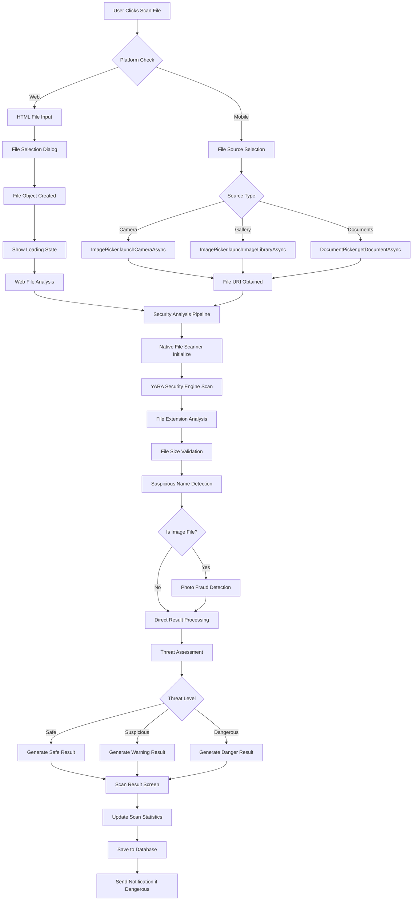

### 2. Link Scanner Service Flow

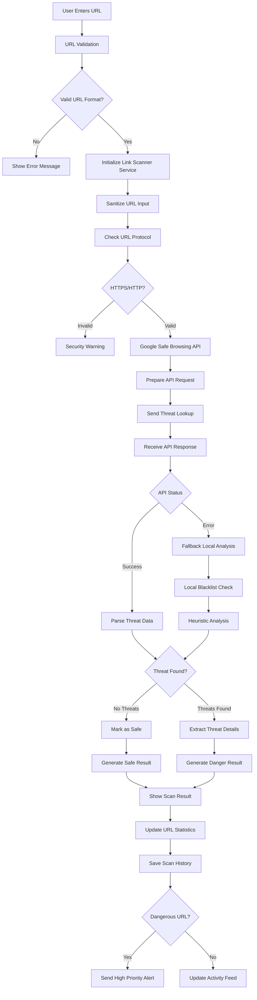

### 3. QR Scanner Service Flow

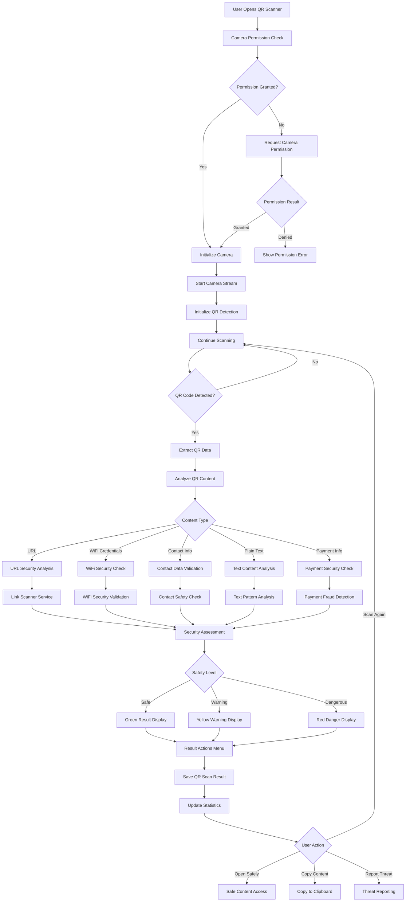

---

## Premium Security Services

### 4. SMS Shield Service Flow

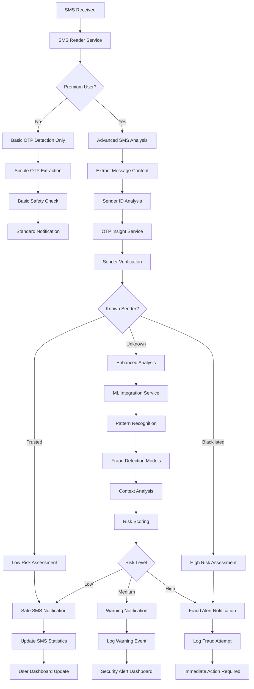

### 5. Secure Browser Service Flow

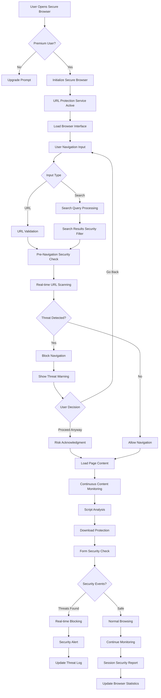

### 6. AI Guardian Service Flow

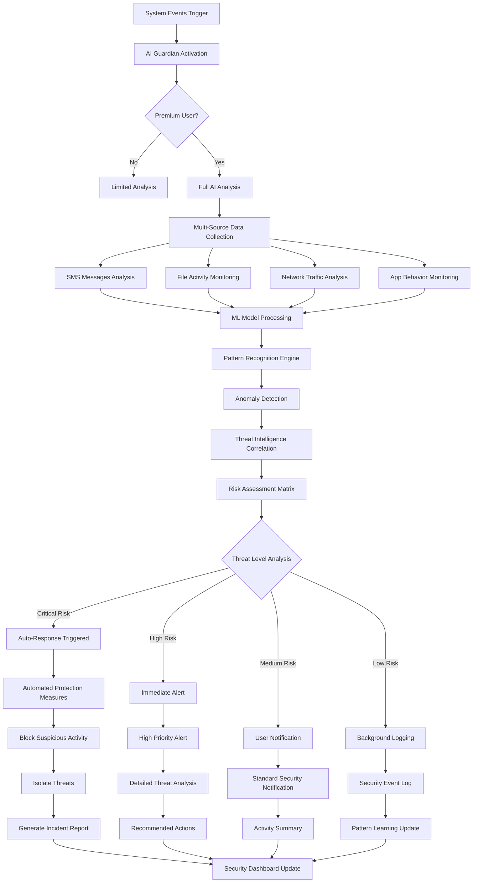

---

## Background Monitoring Services

### 7. Clipboard URL Monitor Service Flow

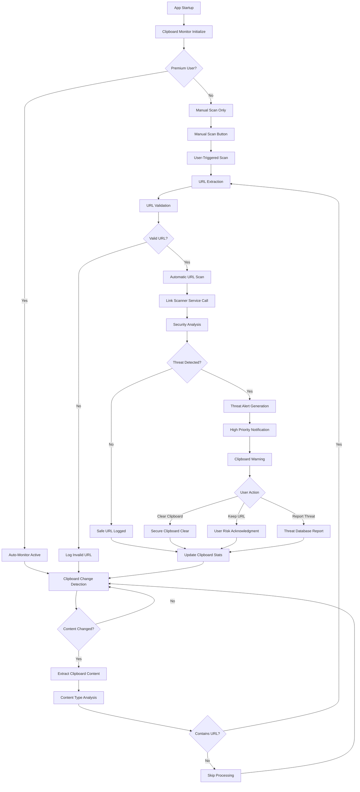

### 8. Share Intent Service Flow

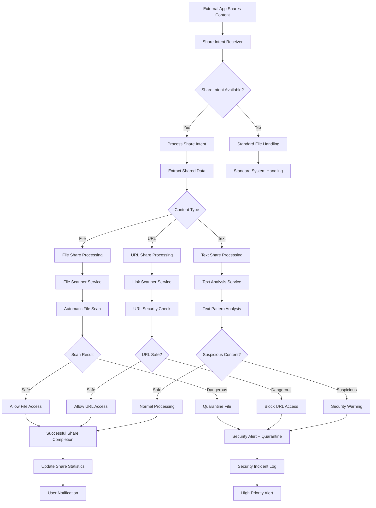

### 9. Global Guard Controller Service Flow

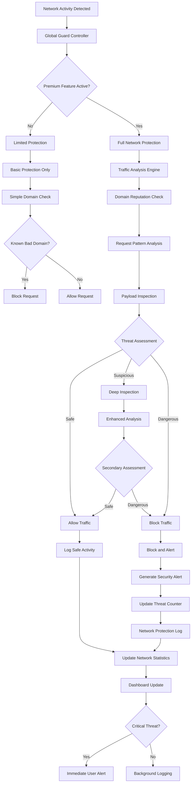

---

## User Interface Services

### 10. Notification Service Flow

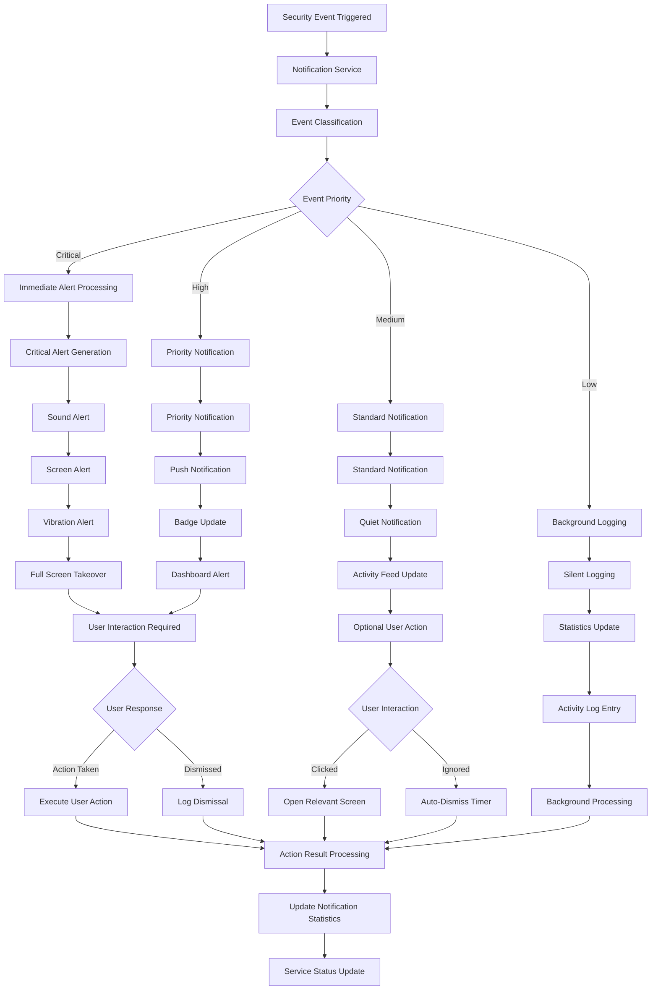

### 11. Settings Management Service Flow

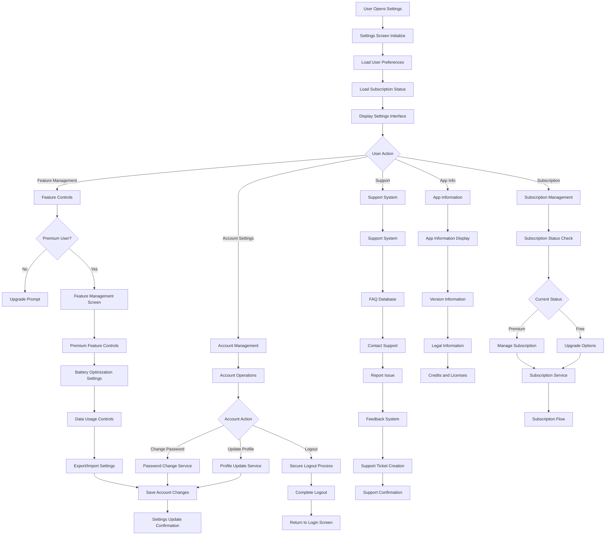

---

## Data Management Services

### 12. Database Management Service Flow

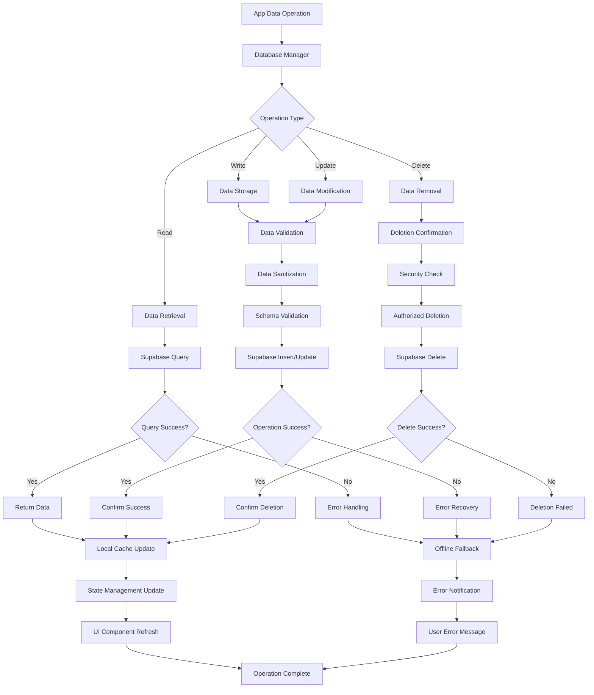

### 13. Local Storage Service Flow

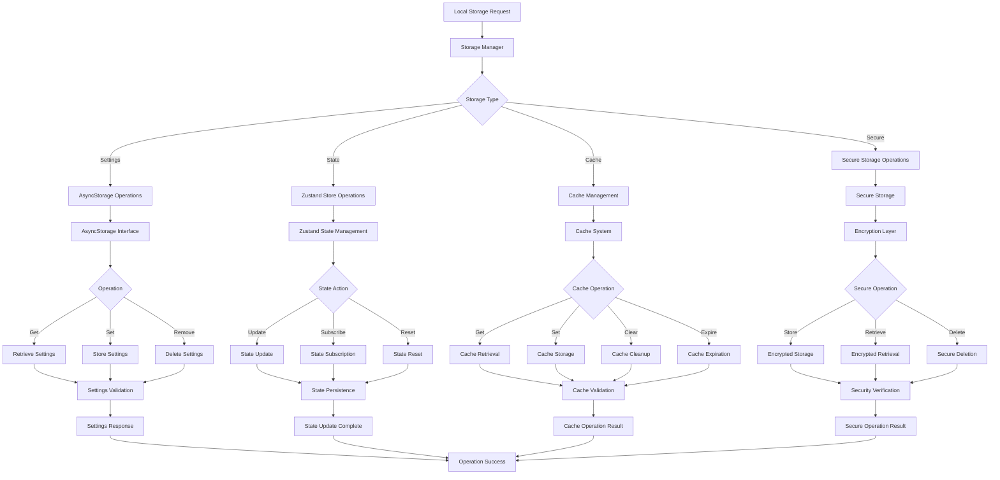

---

## Future Features & Enhancements

### 14. Advanced AI Threat Detection (Future)

```mermaid
graph TD
    A[Enhanced AI System Launch] --> B[Multi-Model AI Engine]
    B --> B1[Deep Learning Models]
    B1 --> B2[Natural Language Processing]
    B2 --> B3[Computer Vision Analysis]
    B3 --> B4[Behavioral Pattern Recognition]
    
    B4 --> C[Advanced Threat Detection]
    C --> C1[Zero-Day Threat Detection]
    C1 --> C2[Predictive Threat Analysis]
    C2 --> C3[Social Engineering Detection]
    C3 --> C4[Advanced Phishing Detection]
    
    C4 --> D[Real-time Learning System]
    D --> D1[Continuous Model Training]
    D1 --> D2[Federated Learning Integration]
    D2 --> D3[Global Threat Intelligence]
    D3 --> D4[Personalized Security Profiles]
    
    D4 --> E[Automated Response System]
    E --> E1[Intelligent Blocking]
    E1 --> E2[Adaptive Security Measures]
    E2 --> E3[Predictive Protection]
    E3 --> E4[Self-Healing Security]
    
    E4 --> F[Advanced User Interface]
    F --> F1[AI Security Assistant]
    F1 --> F2[Voice-Activated Security]
    F2 --> F3[Augmented Reality Threats]
    F3 --> F4[Predictive Security Dashboard]
```

### 15. IoT Device Protection (Future)

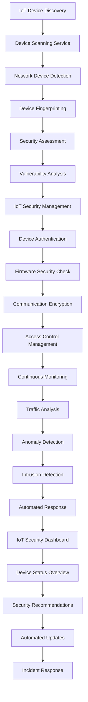

### 16. Blockchain Security Integration (Future)

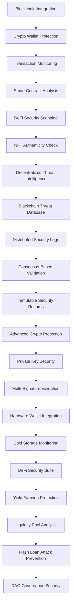

### 17. Enterprise Security Management (Future)

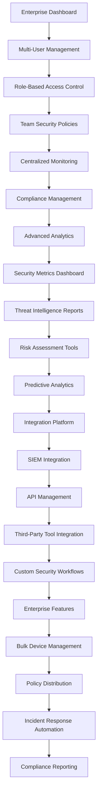

### 18. Privacy Enhancement Suite (Future)

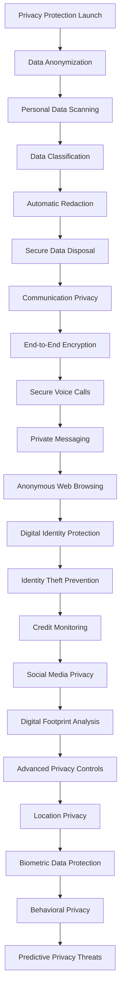

---

## Service Integration Architecture

### 19. Complete Service Orchestration Flow

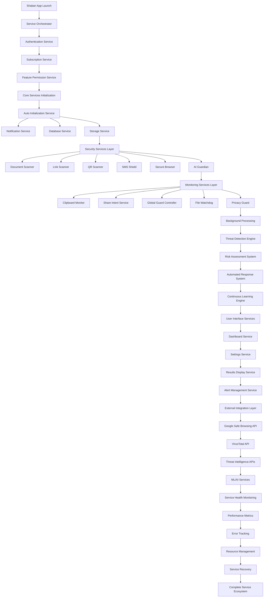

---

## Summary

This comprehensive flowchart documentation covers:

✅ **Current Implemented Services (17 services)**
- Core Security Services (Document, Link, QR Scanners)
- Premium Services (SMS Shield, Secure Browser, AI Guardian)
- Background Monitoring (Clipboard, Share Intent, Global Guard)
- UI Services (Notifications, Settings)
- Data Management (Database, Local Storage)

✅ **Future Enhancement Services (4 major areas)**
- Advanced AI Threat Detection
- IoT Device Protection
- Blockchain Security Integration
- Enterprise Security Management
- Privacy Enhancement Suite

✅ **Complete Architecture Overview**
- Service orchestration and integration
- Cross-service communication flows
- Scalability and extensibility planning

Each flowchart provides detailed step-by-step processes, decision points, error handling, and integration touchpoints for comprehensive understanding of the Shabari cybersecurity application architecture.

