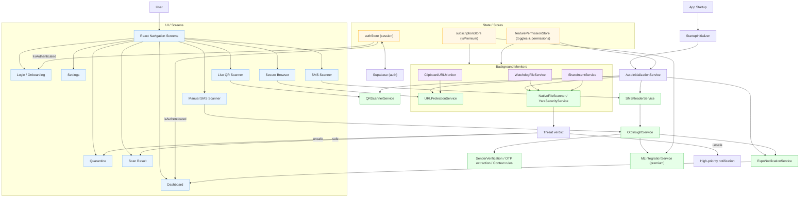

## Shabari App Model

This document summarizes how the app works today so it can be presented to anyone quickly. It includes a top-level architecture diagram, key flows, and a compact feature map.

### Architecture Overview

### Key Flows

- **Authentication & Subscription**: `authStore` manages session with Supabase; `subscriptionStore` syncs premium status. Navigation chooses `Onboarding/Login` or `Dashboard`.
- **Startup**: `StartupInitializer` runs, then `AutoInitializationService` prepares Notifications, URL Protection, File Scanner/YARA, QR Scanner, and SMS (smart/on-demand on Android).
- **SMS/OTP Analysis**: `SMSReaderService` captures messages → `OtpInsightService` runs sender checks, OTP extraction, context rules, optional ML (premium) → user notified via `ExpoNotificationService`.
- **URL Protection**: Manual scans from `SecureBrowser` and background `ClipboardURLMonitor` feed into `URLProtectionService` for checks.
- **File Scanning & Quarantine**: `WatchdogFileService` and `ShareIntentService` trigger scans via `NativeFileScanner`/`YaraSecurityService`. Unsafe files produce high-priority notifications and appear in `Quarantine`.
- **QR Scanning**: `LiveQRScannerScreen` uses `QRScannerService` for safe parsing and checks.
- **Feature Controls**: `featurePermissionStore` holds premium toggles, permission states, and optimization modes; integrates with auto-init and background monitors.

### Feature Map (Where to show in app)

- **Dashboard**: Status of services, quick actions, and recent scan stats.
- **Settings**: Feature toggles, permissions, and upgrade entry.
- **SMS Scanner / Manual SMS**: Demonstrate OTP Insight and consent-driven analysis.
- **Secure Browser**: Show URL protection and manual scans.
- **Quarantine**: Review unsafe files and actions taken.
- **Live QR Scanner**: Live detection and safe navigation.

### References (core files)

- Navigation: `src/navigation/AppNavigator.tsx`
- Startup: `src/components/StartupInitializer.tsx`, `src/services/AutoInitializationService.ts`
- Stores: `src/stores/authStore.ts`, `src/stores/subscriptionStore.ts`, `src/stores/featurePermissionStore.ts`
- Services: `src/services/*` (URLProtection, WatchdogFile, NativeFileScanner, YaraSecurityService, QRScannerService, SMSReaderService, ExpoNotificationService)
- OTP Insight: `src/services/OtpInsightService.ts`, `src/lib/otp-insight-library/src/*`
- Backend: `src/lib/supabase.ts`

---

Tip: You can present this diagram directly on GitHub (Mermaid is supported), then walk through the flows using the screen names above.

